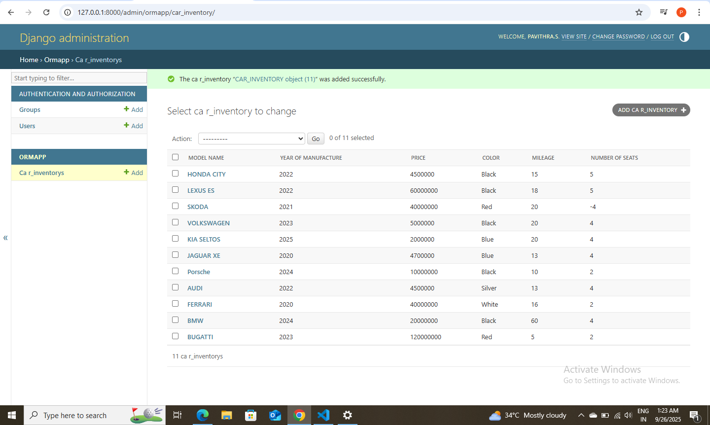

# Ex02 Django ORM Web Application
# Date: 26/09/2025
# AIM
To develop a Django application to store and retrieve data from a bank loan database using Object Relational Mapping(ORM).

## DESIGN STEPS
## STEP 1:
Clone the problem from GitHub

## STEP 2:
Create a new app in Django project

## STEP 3:
Enter the code for admin.py and models.py

## STEP 4:
Execute Django admin and create details for 10 books

# PROGRAM 
```
admin.py

from django.contrib import admin
from.models import CAR_INVENTORY,CAR_INVENTORYAdmin
admin.site.register(CAR_INVENTORY,CAR_INVENTORYAdmin)

models.py 

from django.contrib import admin
from django.db import models
class CAR_INVENTORY (models.Model):
    model_name=models.CharField(max_length=15)
    year_of_manufacture=models.IntegerField()
    price=models.IntegerField()
    color=models.CharField(max_length=15)
    mileage=models.IntegerField()
    number_of_seats=models.IntegerField()

class CAR_INVENTORYAdmin(admin.ModelAdmin):
    list_display=('model_name','year_of_manufacture','price','color','mileage','number_of_seats')
```
# OUTPUT



# RESULT
Thus the program for creating a database using ORM hass been executed successfully
